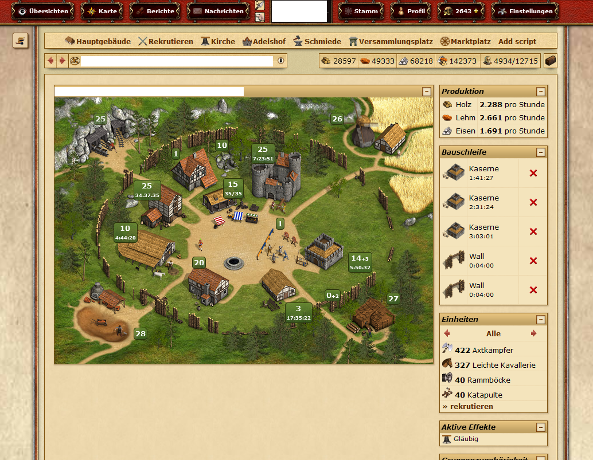
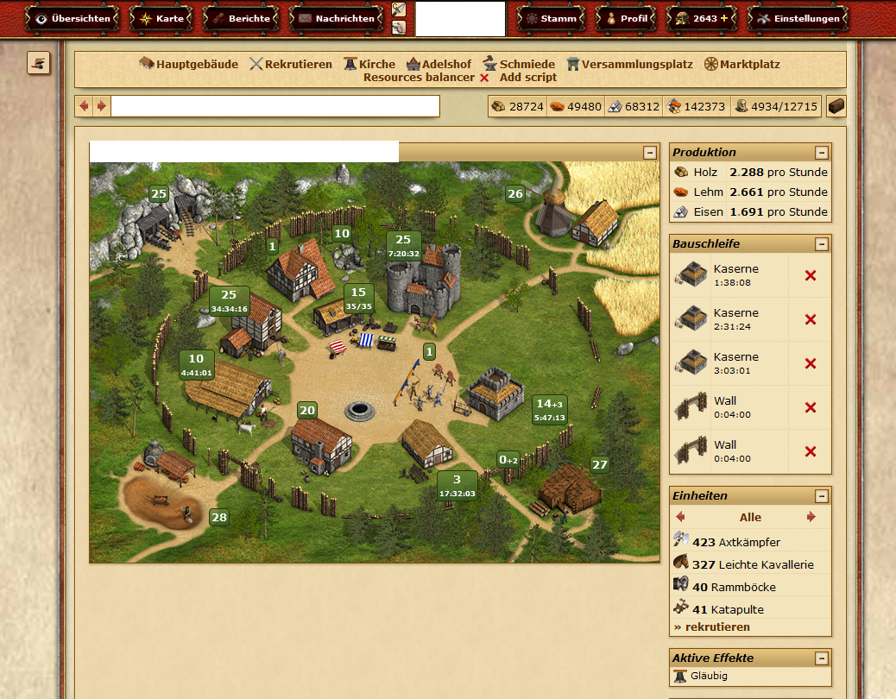

# Dynamic quick link scripts

Lets the user add new quickbar scripts which are only saved in the browsers local storage.

## 🚀 How to use it?
Navigate to any screen and press the 'Add script' entry in the quickbar.

