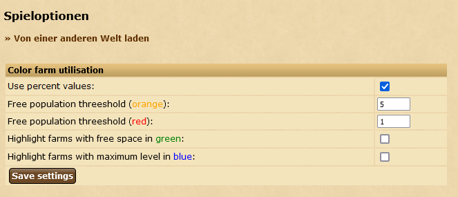

# Color farm utilisation

Highlights the farm utilisation in the production overview and lets the user configure custom threesholds

## 🚀 How to use it?
Navigate to settings -> Game options and configure it. After that go to overview -> production to see the script in action

